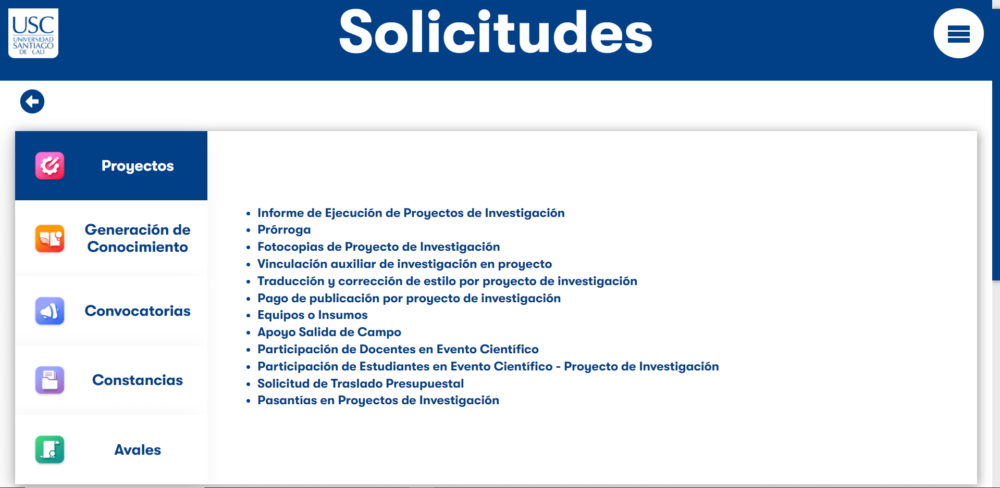
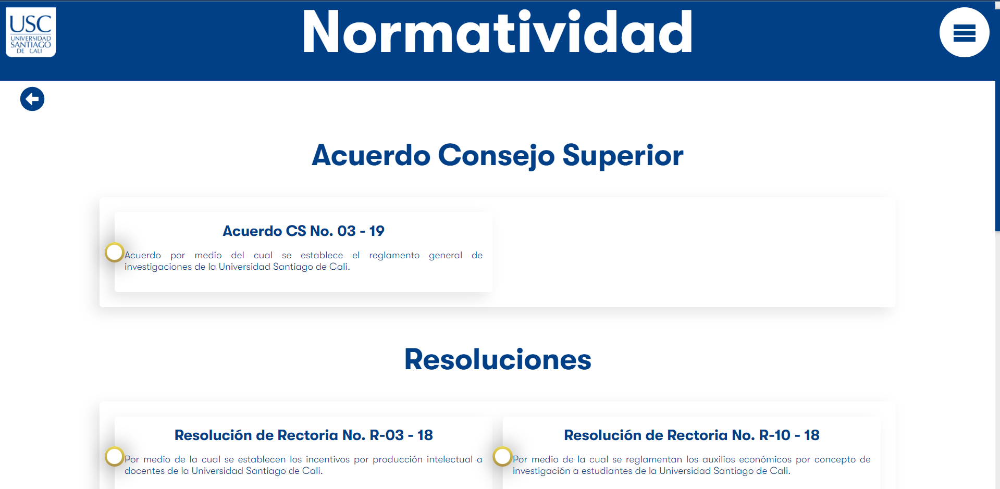

# Dirección General de Investigaciones

### Homepage

### Solicitudes

### Normatividad

### Normatividad

## Tech Stack

    

## Create-React-App

This project was bootstrapped with [Create React App](https://github.com/facebook/create-react-app).

## Available Scripts

In the project directory, you can run:

### `npm start`

### `npm test`

### `npm run build`

### `npm run eject`

## Learn More

You can learn more in the [Create React App documentation](https://facebook.github.io/create-react-app/docs/getting-started).

To learn React, check out the [React documentation](https://reactjs.org/).
